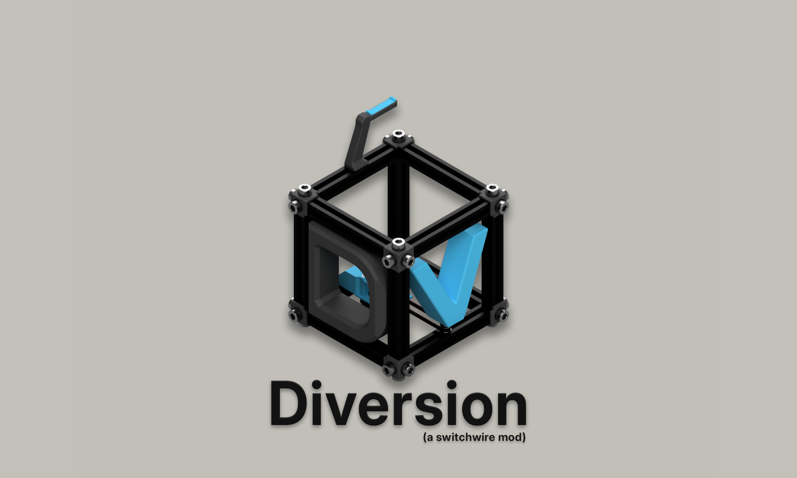
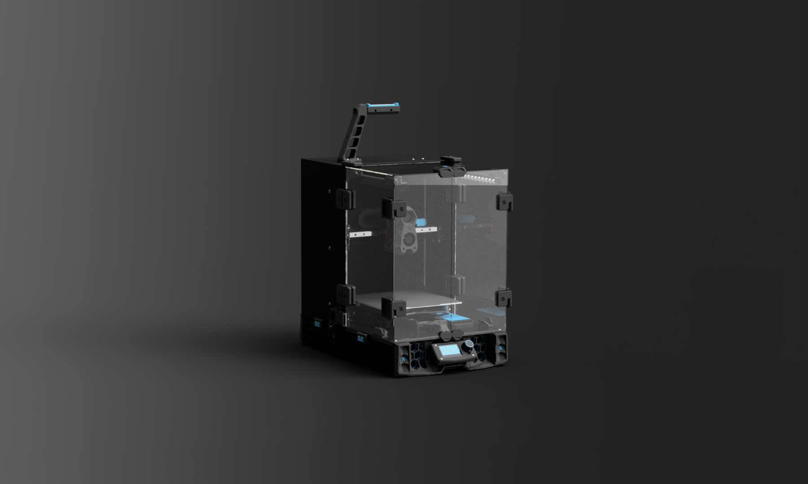

Diversion MK_I (ALPHA State)
================

$\color{Red}{\textbf{My Disclaimer:}}$
--------------------------------
Diversion [dəˈvərZHən] is a [Switchwire](https://github.com/VoronDesign/Voron-Switchwire) Mod. It is <ins>not</ins> an official Voron release, it is not a scratch build printer (it is based on the original’s Switchwire kinematics and build), BUT it is a project made with dedication and respect to the efforts of all the community.

The Printer:
--------------

The idea behind this project was to build a solid base, while using parts that are either easily accessible from the market or recycle parts from old printers that were laying around. I always admired the subtle way Voron Team designed their parts but I wanted to exaggerate a bit, while making a machine for my personal use.

The design is heavily affected by improvements and modifications, suggested by the community (credits of which can be found at the end of the page).

The basic hardware that is required for this build is common to a Voron build. You will notice an excessive amount of 6x3mm magnets (compared to a typical printer) which was necessary in order to achieve a clean and modular enclosure.

The Build:
--------------
Instructions and clarification regarding various parts of this build will be added soon.

BOM:
--------------
[Link](./docs/BoM.md)

Special Thanks to:
--------------------
+ Voron Team for providing a solid base to start from (The Original SW).
+ All of this loving 3D printing community on the Voron Discord servers.
+ Yenda and Strayr for the idea of the more robust x/z motors.
+ richardjm for his snap-latch-2020 mod, which is used with tiny modifications.
